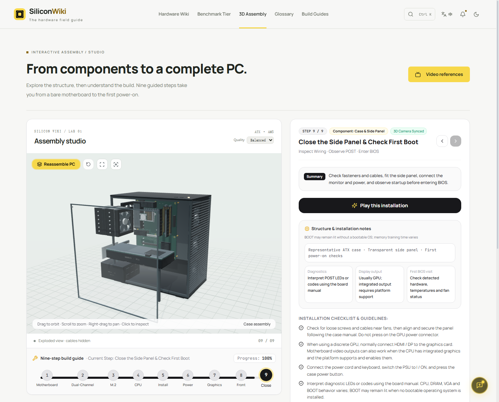

<div align="center">
  
  <h1>SiliconWiki</h1>
  <p>Explore hardware. Understand the build.</p>
  <p>Hardware encyclopedia · Reference comparisons · Interactive 3D assembly</p>
  <p>
    <a href="https://computer-wiki.vercel.app/">Live demo</a>
    &nbsp; / &nbsp;
    <a href="#quick-start">Run locally</a>
    &nbsp; / &nbsp;
    <a href="README.md">简体中文</a>
  </p>
</div>

---

SiliconWiki brings hardware explanations, specification comparisons and PC assembly into one learning space. Look up an unfamiliar term, compare processors, or follow a nine-step build to understand how the parts fit together.

The site supports **English and Simplified Chinese**, light and dark themes, and keyboard search. It is built with React, TypeScript and Three.js, with content maintained alongside the code.

[Features](#features) · [Assembly studio](#assembly-studio) · [Data sources](#data-sources) · [Quick start](#quick-start) · [Configuration](#configuration) · [Architecture](#architecture)

<a id="features"></a>

## Features

| Module | What you can do |
| --- | --- |
| Hardware encyclopedia | Explore CPUs, GPUs, motherboards, memory, storage, power supplies, cooling, cases and laptops |
| Performance comparisons | Browse reference rankings by use case and compare specifications and relative scores side by side |
| 3D assembly studio | Follow nine assembly steps, orbit and zoom around procedural models, focus on components and inspect an exploded view |
| Glossary | Connect hardware terminology with plain-language explanations and practical examples |
| Example builds | Review component lists, selection notes and reference prices, then copy a build as text |
| Global search | Press `Ctrl + K` or `⌘ + K` to find hardware, terminology and site content |

Hardware illustrations use a consistent graphite, metal and warm-gold palette across light and dark themes. Images marked as illustrations show representative component shapes; they are not photographs of the exact product. Compact versions also fit comparison panels and table rows.

<a id="assembly-studio"></a>

## 3D assembly studio

The studio uses a representative **AM5 / DDR5 / ATX tower PC** to explain component placement, orientation and assembly order. The procedural model includes motherboard details, an M.2 mounting position, cooling fins and heat pipes, a graphics card, power cables and a transparent side panel.



*Actual English interface, showing the exploded view in the light theme.*

`CPU → Memory → M.2 SSD → CPU cooler → Motherboard into case → Power supply → Graphics card → Front-panel wiring → First power-on`

- **Grounded proportions and orientation.** The ATX motherboard follows 305 × 244 mm proportions. Two memory modules occupy A2/B2, an M.2 2280 drive enters at approximately 30°, the tower cooler exhausts toward the rear, and a conventionally mounted graphics card has downward-facing fans.
- **Connected assembly movement.** The installed CPU, memory, SSD and cooler move with the motherboard when it enters the case. The power supply enters through the rear opening, and the side panel approaches along its own normal.
- **Repeatable inspection.** Orbit, pan, zoom, component focus, step navigation and the exploded view expose spatial relationships. Restoring the assembly returns components to their original transforms.
- **Motion preferences and recovery.** A cancellable animation timeline supports repeated navigation and reduced motion. If 3D loading fails, the interface provides a fallback message.

The studio defaults to **Balanced** quality. All three profiles cap rendering pixels according to canvas size and device pixel ratio. Rendering pauses when the scene is out of view or the page is in the background. Fan update targets do not guarantee the same frame rate on every device.

| Quality | Shadows and fan demonstration |
| --- | --- |
| Saver | Shadows off; target fan updates at 20 Hz |
| Balanced (default) | Cached shadows; target fan updates at 30 Hz |
| Detailed | Higher pixel budget; target fan updates at 60 Hz |

**Model scope.** This is educational geometry and animation, not product-specific CAD or a thermal, electrical, collision or full-system compatibility simulator. Fan rotation indicates the demonstrated powered state, not measured speed, temperature or load. Consult the actual product manuals for mounting points, mechanisms, cables and installation order.

<a id="data-sources"></a>

## Content and data sources

Specifications, rankings, example builds and prices live in [`src/data/`](src/data/) as **static content maintained with the repository**. Reference scores help explain relative positioning; they do not replace tests performed under matching conditions. The application has no live benchmark or pricing API.

Selected products also have a [reviewed manufacturer-specification snapshot](src/data/sources/verifiedHardware.ts). It records source links, review dates, original field names and the scope of each check. Current coverage includes selected technical fields for the Ryzen 7 9800X3D, Ryzen 7 7800X3D, Ryzen 9 9950X, GeForce RTX 5090 and RTX 5080.

**Verification applies only to explicitly listed fields.** It does not certify every statement about a product, its benchmark scores or prices, or the rest of the catalog. NVIDIA snapshots use reference-design specifications and do not automatically apply to regional variants or factory-overclocked partner cards.

| Content | How to interpret it |
| --- | --- |
| Local encyclopedia and build content | Editorial learning material updated with the code |
| Reviewed specification fields | A dated, field-by-field snapshot checked against the stated product source |
| Reference rankings and prices | Comparison aids, not live measurements or purchase quotes |
| Third-party product information | Material for browsing, importing and manual review, not manufacturer certification |

The repository also includes a [single-page ZOL candidate importer](scripts/import_zol.py). It reads an **undocumented internal endpoint used by ZOL's PC-builder website**, not a documented official open API. It currently supports the first page of CPU keyword searches, without pagination or automatic updates to application specifications, prices or images.

To maintain candidate source data, install Python 3.10 or newer and run from the repository root:

```bash
python scripts/import_zol.py --keyword 9800X3D --output data/sources/zol-9800x3d-new-check.json
python -m unittest discover -s scripts -p test_import_zol.py
```

The importer uses only the Python standard library. Choose a new output filename: existing files are never overwritten. Candidates retain their source and observation time and require field-by-field review before promotion into the reviewed snapshot. Listed quotes are recorded separately and do not populate the application's price history. See the [data-source guide](docs/data-sources.md) for endpoint behavior, candidate format and offline reproduction. Running the website does not require Python, and the browser makes no requests to this endpoint.

Shopping links open external platform search results. They do not verify sellers, availability, transaction prices or permanent link validity. External references help readers investigate further; their presence does not imply source approval or endorsement.

The assembly guidance references [MSI's M.2 installation guide](https://www.msi.com/support/technical_details/MB_Upgrade_SSD) for insertion angle and [Noctua's cooler-orientation guidance](https://www.noctua.at/en/support/faqs/in-which-orientation-should-noctua-coolers-be-installed) for airflow. Slot placement, wiring and diagnostic indicators depend on the actual motherboard; this [MSI AM5 motherboard manual](https://download-2.msi.com/archive/mnu_exe/mb/MPGB850EDGETIWIFI_English.pdf) is one example.

<a id="quick-start"></a>

## Quick start

Install Node.js and npm, then run these commands from the project directory:

```bash
npm install
npm run dev
```

Open the local URL printed in the terminal. Core encyclopedia browsing requires no API key. The assembly studio requires a WebGL-capable browser; external videos and shopping links require a network connection.

| Command | Purpose |
| --- | --- |
| `npm run dev` | Start the Vite development server |
| `npm test` | Run the Vitest suite |
| `npm run build` | Check TypeScript and generate a production build |
| `npm run preview` | Preview an existing production build locally |

<a id="configuration"></a>

## Configuration and deployment

The default setup needs no `.env` file, API credentials or database. Switch language and theme in the site interface. Core content comes from local TypeScript data modules; external videos, product searches and online references remain network-dependent.

Pass development-server options through Vite, for example `npm run dev -- --port 5174`. The asset base is configured in [`vite.config.ts`](vite.config.ts), currently using the relative path `./`.

`npm run build` writes the static production site to `dist/`. Deploy that directory to a static hosting service. Use `npm run preview` to inspect the build locally, and run tests and a production build before publishing. Check the actual hosting path, image assets and 3D scene loading on the deployed site.

<a id="architecture"></a>

## Code guide

The [hardware data model](docs/hardware-data.md) separates exact model identity, field evidence, sources, reference prices and benchmark records. Missing measurements remain empty. See the [link audit](docs/link-audit.md) for repaired addresses and the distinction between reachable pages, matching products and sources that could not be verified.

The [3D performance report](docs/performance.md) records a 63.6% reduction in draw calls in a controlled software-renderer comparison with unchanged triangle detail; it is not a hardware FPS guarantee.

| Path | Responsibility |
| --- | --- |
| [`src/components/assembly/`](src/components/assembly/) | Assembly interface, Three.js scene and animation |
| [`src/components/wiki/`](src/components/wiki/), [`rankings/`](src/components/rankings/), [`builds/`](src/components/builds/) | Encyclopedia, performance comparisons and example-build interfaces |
| [`src/components/search/`](src/components/search/), [`glossary/`](src/components/glossary/) | Global search and terminology interactions |
| [`src/data/`](src/data/) | Hardware, rankings, assembly steps and other static content |
| [`src/data/sources/`](src/data/sources/) | Reviewed specification fields and provenance records |
| [`scripts/import_zol.py`](scripts/import_zol.py), [`data/sources/`](data/sources/) | Single-page candidate import and source snapshots awaiting review |
| [`src/context/`](src/context/), [`src/i18n/`](src/i18n/) | Application state, language and theme logic |
| [`src/utils/`](src/utils/), [`src/__tests__/`](src/__tests__/) | Reusable logic and automated tests |
| [`docs/assets/`](docs/assets/) | Original README cover and application screenshots |

The assembly scene separates responsibilities across small modules: `PCScene3D.ts` manages lifecycle, input and rendering; `pcModel.ts` builds geometry and component hierarchies; `modelResources.ts` owns shared GPU resources and disposal; and `animation.ts` computes absolute poses with pure functions and manages cancellable timelines. These files live in `src/components/assembly/`.

In the same directory, `renderingBudget.ts` defines pixel budgets and fan update intervals for each quality profile. `batchStaticMeshes.ts` combines suitable static geometry while preserving component picking and assembly-animation boundaries.

## Contributing

When changing hardware content, check both languages, units and sources, and record the exact model, affected fields and review date. For assembly changes, check skipped steps, repeated playback, exploded-view restoration and reduced motion. Issues and pull requests with reproducible reports or source-backed corrections are welcome.

Built with **React 18 · TypeScript 5 · Three.js · Vite 6 · Tailwind CSS 3 · Vitest**.

Read the [Simplified Chinese README](README.md).
