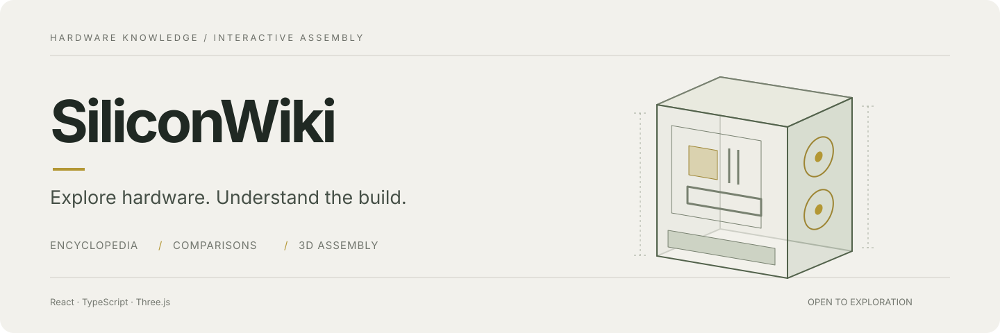
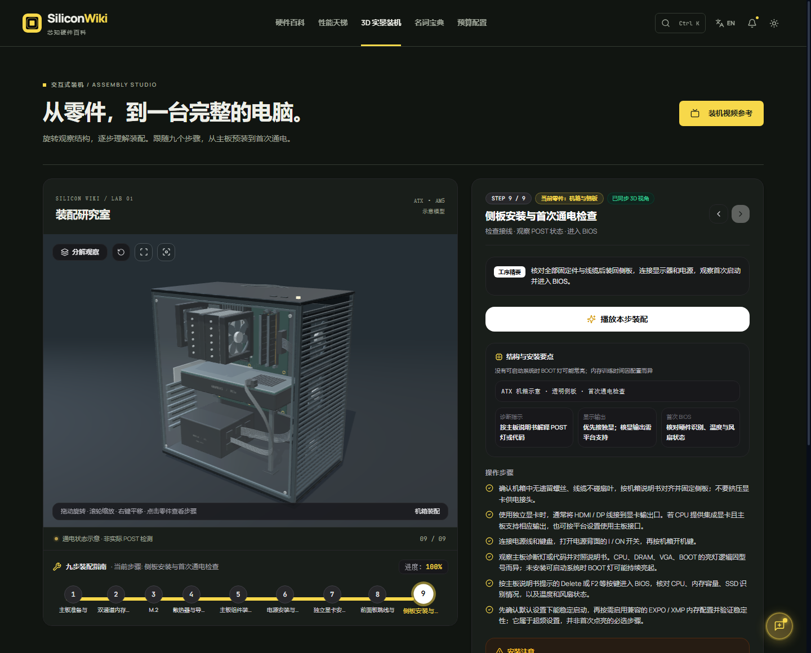
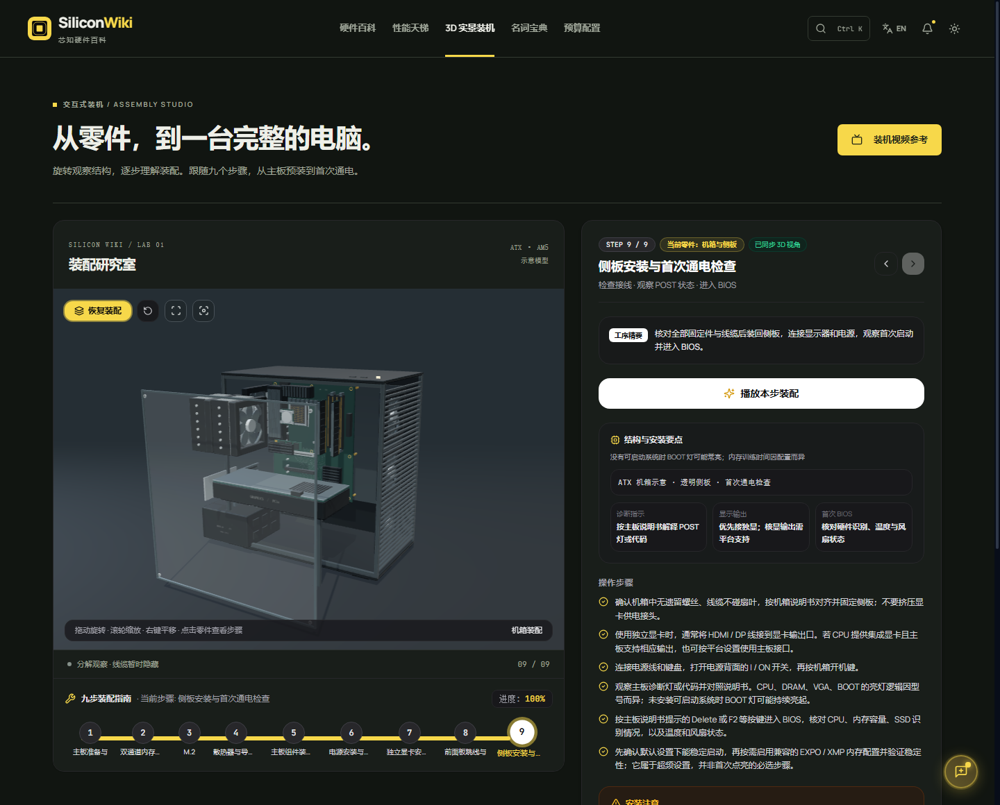

<div align="center">
  
  <h1>SiliconWiki · 芯知</h1>
  <p>看懂硬件，理解每一步装配。</p>
  <p>计算机硬件百科 · 性能对比 · 交互式 3D 装机</p>
  <p>
    <a href="https://computer-wiki.vercel.app/">在线体验</a>
    &nbsp; / &nbsp;
    <a href="#quick-start">本地运行</a>
    &nbsp; / &nbsp;
    <a href="#english">English</a>
  </p>
</div>

---

SiliconWiki 把硬件知识、参数对比与装机过程放在同一个学习空间里。查一个术语、比较几款芯片，或跟随九步引导观察一台电脑如何组装：每个模块都围绕“理解为什么”展开。

网站支持简体中文与 English、明暗主题，以及键盘快捷搜索。项目使用 React、TypeScript 和 Three.js 构建，内容数据随仓库维护。

## 可以做什么

| 模块 | 内容与交互 |
| --- | --- |
| 硬件百科 | CPU、GPU、主板、内存、存储、电源、散热与机箱知识，另含笔记本专题 |
| 性能对比 | 按场景浏览参考排行，并排查看硬件规格与相对分数 |
| 3D 装机室 | 九步装配引导、可旋转缩放的程序化模型、组件聚焦与爆炸视图 |
| 术语词典 | 用通俗解释连接参数、原理与使用场景 |
| 配置参考 | 查看配件清单、搭配思路与参考价格，复制配置文本 |
| 全局搜索 | 使用 `Ctrl + K` / `⌘ + K` 搜索型号、术语与页面内容 |

## 3D 装机室

以一台 **AM5 / DDR5 / ATX 塔式电脑**为教学原型，展示部件之间的位置、方向与安装顺序。模型由代码生成，包含主板布局、M.2 固定位置、散热鳍片与热管、显卡、供电线缆及透明侧板。



`CPU → 内存 → M.2 SSD → 散热器 → 主板入箱 → 电源 → 显卡 → 前面板接线 → 首次通电`

- **有依据的比例与方向**：ATX 主板按 305 × 244 mm 比例构建，双内存使用 A2 / B2，M.2 2280 以约 30° 插入，双塔风冷朝机箱后方排风，常规水平显卡的风扇朝下。
- **连贯的装配关系**：主板入箱时，已安装的 CPU、内存、SSD 和散热器随主板一起移动；电源从后部开口装入，侧板沿自身法线靠近机箱。
- **可反复观察**：旋转、平移、缩放、步骤切换与爆炸视图共同呈现空间关系；恢复装配状态时回到部件原始变换。
- **照顾不同设备与偏好**：场景采用独立动画时间线，支持减少动态效果；3D 加载失败时提供可理解的回退提示。

<details>
<summary>查看爆炸视图 · Exploded view</summary>



</details>

**模型范围**：这是具有代表性的教学几何与装配动画，不是特定产品的 CAD 复刻，也不进行热学、电气、碰撞或整机兼容性验证。风扇转动表示演示中的通电状态，不对应实测转速、温度或负载。实际孔位、安装机构、线材与操作顺序请查阅所用产品说明书。

## 内容与数据

硬件规格、排行、配置单和价格保存在 `src/data/`，属于**随仓库更新的静态内容**。参考分数用于帮助理解相对定位，不能替代同条件下的完整测试；项目未接入实时跑分或价格 API。

电商链接打开平台搜索结果，不保证卖家身份、商品库存、成交价格或链接永久有效。页面中的外部资料链接用于进一步查阅，不表示数据已经获得来源方认证或背书。

装配教学中的 M.2 插入角度参考 [MSI 安装指南](https://www.msi.com/support/technical_details/MB_Upgrade_SSD)，塔式散热器风向参考 [Noctua 安装方向说明](https://www.noctua.at/en/support/faqs/in-which-orientation-should-noctua-coolers-be-installed)。插槽、接线和诊断状态应结合实际主板手册；可参阅 [MSI AM5 主板手册示例](https://download-2.msi.com/archive/mnu_exe/mb/MPGB850EDGETIWIFI_English.pdf)。

<a id="quick-start"></a>

## 本地运行

准备 Node.js 与 npm，在项目目录中执行：

```bash
npm install
npm run dev
```

打开终端显示的本地地址。百科与内容浏览无需配置 API 密钥；3D 装机室需要支持 WebGL 的浏览器，外部视频和电商链接需要网络连接。

| 命令 | 用途 |
| --- | --- |
| `npm run dev` | 启动 Vite 开发服务器 |
| `npm run test` | 运行 Vitest 测试 |
| `npm run build` | 执行 TypeScript 检查并生成生产构建 |
| `npm run preview` | 本地预览已生成的构建 |

生产文件输出到 `dist/`。项目采用相对资源路径，可将该目录部署到静态站点托管服务；正式发布前先运行测试与构建，并检查实际托管路径。

## 代码导览

| 路径 | 职责 |
| --- | --- |
| `src/components/assembly/` | 装机界面、Three.js 场景与动画逻辑 |
| `src/components/wiki/`、`rankings/`、`builds/` | 百科、性能对比与配置单界面 |
| `src/components/search/`、`glossary/` | 全局搜索与术语交互 |
| `src/data/` | 硬件、排行、装机步骤和其他静态内容 |
| `src/context/`、`src/i18n/` | 应用状态、语言和主题相关逻辑 |
| `src/utils/`、`src/__tests__/` | 可复用逻辑与自动化测试 |
| `docs/assets/` | README 视觉素材 |

装机场景按职责拆分：`PCScene3D.ts` 管理生命周期、输入与渲染；`pcModel.ts` 构建几何及组件层级；`modelResources.ts` 统一管理共享 GPU 资源与释放；`animation.ts` 用纯函数计算绝对姿态，并管理可取消的动画时间线。这些模块均位于 `src/components/assembly/`。

修改硬件内容时，请同时核对中英文、单位与来源；修改装机逻辑时，请检查跳步、重复播放、爆炸视图恢复及减少动态效果。欢迎通过 Issue 或 Pull Request 提交可复现的问题和有出处的修正。

---

<a id="english"></a>

## English

**SiliconWiki** brings hardware explanations, reference comparisons and a guided 3D PC build into one bilingual learning space. Explore components and laptop topics, compare specifications, look up terminology, browse example builds, and search across the site with `Ctrl + K` or `⌘ + K`.

The assembly studio depicts a representative **AM5 / DDR5 / ATX desktop** across nine steps. Its procedural geometry demonstrates motherboard proportions, A2/B2 memory placement, angled M.2 insertion, front-to-rear tower cooling, conventional horizontal GPU mounting and the movement of an assembled motherboard into the case. Orbit controls, component focus and an exploded view make these relationships easier to inspect.

The scene is an **educational illustration**, not product-specific CAD or a thermal, electrical, collision or compatibility simulator. Animated fans indicate the demonstrated powered state, not measured operating conditions. Actual installation details come from the relevant product manuals. The studio also supports reduced motion and provides a fallback if 3D loading fails.

**Data provenance.** Specifications, reference scores, builds and prices are local static data maintained in `src/data/`. There is no live benchmark or pricing API. Rankings are learning references; shopping links lead to external search results and do not verify listings, sellers or availability.

**Run locally.** Install Node.js and npm, then run the following from the project directory:

```bash
npm install
npm run dev
npm run test
npm run build
```

Use `npm run preview` to inspect the production build. Static output is written to `dist/`. Core content needs no API key; the assembly view requires WebGL, and external links require a network connection.

Built with **React 18 · TypeScript 5 · Three.js · Vite · Tailwind CSS · Vitest**. Contributions that improve clarity, accessibility, reproducibility or source accuracy are welcome.
