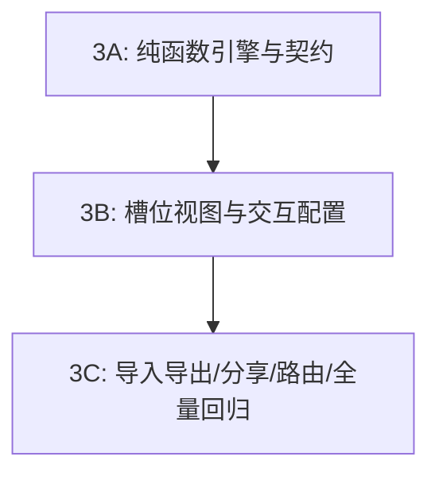

# SiliconWiki 阶段 3 实施规范：自选装机配置器与兼容性检查系统 (PHASE 3 PLAN)

本文档定义 SiliconWiki 阶段 3（自选装机配置器与兼容性检查系统）的技术架构、数据契约、算法规则与验收标准。
本阶段严格聚焦装机配置与纯函数兼容性评估，不破坏或重构阶段 1、阶段 2 已验收代码，不扩展至阶段 4。

---

## 阶段目标与设计原则

1. **确定性与保守准入（继承阶段 2 核心理念）**：
   - 兼容性检查坚决杜绝“无数据便假定装得下”或“功耗缺失便算作 0W”；
   - 规则判定严格区分五态：`pass`（通过）、`warning`（警告）、`error`（硬冲突）、`unknown`（未知/信息不足）与 `not-applicable`（不适用）；
   - `unknown` 在底层为独立状态，严禁被折叠合并为 `warning`。
2. **纯函数解耦与规格适配分层**：
   - 兼容性评估、功耗估算、成本计算全部作为独立纯函数实现，零 DOM 与 React 状态依赖；
   - 规格提取集中于适配层（`specAdapter`），以阶段 2 的 `HardwareRecord` 结构化目录为主入口，保留字段身份、单位、来源、核验状态及适用条件。
3. **安全透明的数据契约与分享**：
   - 装机单采用带版本控制的数据契约（`schemaVersion: 1`），用户自定义改价与目录参考价严格隔离；
   - 导入遵循“解析与校验 → 预览 → 应用”三段式流程，访问分享链接绝不静默冲刷用户已有本地草稿；
   - 本地保存失败时不中断编辑，如实提示未保存状态。

---

## 一、兼容性状态系统与诊断报告架构

### 1. 规则状态五态定义

| 状态 | 标识 | 含义与判定准则 |
| :--- | :--- | :--- |
| `pass` | 通过 | 在**当前已知且核实**的参数条件下，规则判定物理/电气契约完全满足。仅代表对应单项规则通过，**不代表整机无死角兼容**。 |
| `warning` | 警告 | 存在潜在风险、安装受限、需要手动调整（如高马甲内存可能需抬升风扇、电源冗余空间偏小、机箱安装水冷后缩减显卡限长）。 |
| `error` | 硬冲突 | 物理无法安装（如插槽不符、显卡超长、散热超高、主板板型超出机箱最大规格）或严重电气风险（电源额定低于系统计算基底、缺少必要供电线缆）。 |
| `unknown` | 未知 | **信息不足或关键规格未记录**（如非公显卡实际长宽高缺失、机箱限长未标明、扣具支持不明）。引擎层严禁将其隐式归入 warning 或 pass。 |
| `not-applicable` | 不适用 | 因装机单配置特性导致当前规则无需评估（如未选配独立显卡、未选配水冷排、核显平台等）。 |

### 2. 整机兼容性汇总状态决策树

- 若存在任意一项 `error` $\rightarrow$ 整机状态为 `error`（存在严重物理/电气冲突）；
- 否则，若存在任意一项 `warning` $\rightarrow$ 整机状态为 `warning`（存在装机注意事项）；
- 否则，若存在任意一项 `unknown` 或**核心槽位尚未选齐**（缺 CPU、缺主板、缺内存、缺电源、缺机箱或缺少有效显示输出） $\rightarrow$ 整机状态为 `unknown`（显示“部分项目待核验 / 配置未齐备，无法断言整机兼容”）；
- 只有当**所有必检项均评估完毕且全部为 `pass`，且无任何 `unknown` / `warning`** 时 $\rightarrow$ 整机状态方可标为 `pass`（文案严格限制为“已知规则校验通过”，严禁妄称“整机绝对 100% 兼容”）。

### 3. 未覆盖规则范围主动披露

本版（V1）尚未覆盖的高阶装机检查项须在报告末尾明确列出，**严禁将其算作通过**：
- PCIe 通道拆分与 CPU/PCH 共享带宽挤占（如插满 M.2 是否导致第二条 PCIe 插槽降速）；
- SATA 接口与部分 M.2 物理通道复用冲突；
- 高马甲内存与双塔风冷前置风扇物理避位公差；
- 定制模组线线序与异形电源插头空间干涉；
- 机箱内部风道负压/正压气流仿真。

### 4. 选择器候选过滤准则

- 配件库选择器默认开启过滤器：**“排除已知冲突，保留待核实型号”**；
- 过滤机制：过滤掉与当前已选配件产生明确 `error` 的硬件，**保留 `pass` 以及缺少参数的 `unknown` 型号**；
- 界面文案：候选配件明确标注“无已知硬冲突”，**绝对禁止将未经全部核实的候选配件称为“已确认完全兼容”**。

---

## 二、规格读取、归一化与证据层

### 1. 结构化目录作为主入口

- 核心规格优先从 `HardwareRecord` 结构化数据读取：
  - `record.entityKind`：明确区分 `chip`（核心芯片）、`reference-product`（公版参考品）与 `partner-variant`（非公零售商品）；
  - `record.variantDetails`：读取厂商长宽高 `lengthMm`、槽厚 `slotThickness`、供电接口 `powerConnectors`；
  - `record.power`：读取具有可信度证据的标准功耗与适用条件；
- 旧数据 `specs: Record<string, string>` 解析全部收拢至 `src/utils/specAdapter.ts` 集中处理，规则函数禁止就地编写零散的正则或模糊字符匹配。

### 2. 字段提取返回值结构契约

```ts
export interface FieldExtractionResult<T> {
  isKnown: boolean;
  value: T | null;
  fieldId: string;
  unit?: string;
  sourceKind?: SourceKind;
  verificationStatus?: VerificationStatus;
  variantModel?: string;
  condition?: string;
  rawText?: string;
}
```

### 3. 严格禁止猜测与公版混用

- **公版参数隔离**：公版显卡（`reference-product`）的尺寸、槽厚与供电接口，**绝对不得**自动附着于该芯片核心下的其他非公商品（`partner-variant`）；若非公商品未单独核验尺寸，返回 `isKnown: false, value: null`；
- **分词与板型边界**：
  - 板型提取必须严格匹配完整代号：`E-ATX`、`ATX`、`Micro-ATX`（或 `M-ATX`）、`Mini-ITX`（或 `ITX`）；
  - 严禁用 `str.includes('ATX')` 笼统判断，避免将 `Micro-ATX` 误判为 `ATX`；
- **多条件/冲突处理**：当规格文本包含多种安装条件（如“拆除前风扇后限长 380mm，带前风扇限长 335mm”），在无明确装配输入时，提取安全基线值并在 `condition` 中保留完整说明；若文本矛盾或混写，统一降级为 `unknown`。

---

## 三、第一版（V1）兼容性检查矩阵

| 规则 ID | 检查项 | 涉及配件 | 判定逻辑与准入要求 | 异常处理 (Error / Warning / Unknown) |
| :--- | :--- | :--- | :--- | :--- |
| `rule_socket_match` | CPU ↔ 主板插槽物理匹配 | CPU + 主板 | 归一化插槽名称（如 `AM5`, `AM4`, `LGA1700`, `LGA1851`, `LGA1200`）。完全一致才通过。 | 不一致报 `error`；任一方插槽未知报 `unknown`。 |
| `rule_bios_support` | 主板 CPU 支持与 BIOS 条件 | CPU + 主板 | 核验该代 CPU 是否需要更新 BIOS 才能点亮（如 600 系主板搭配 14 代 Intel，或 B650 搭配 9000 系 AMD）。 | 确认需要升级报 `warning`（提示准备无 CPU 刷 BIOS 方案）；信息不全报 `unknown`。 |
| `rule_ram_type_match` | 内存代际 ↔ 主板与 CPU 支持 | 内存 + 主板 + CPU | 校验 DDR4 / DDR5。主板仅支持 DDR4 时不可选 DDR5；CPU（如 AM5）仅支持 DDR5 时严禁搭配 DDR4。 | 代际冲突报 `error`；未知报 `unknown`。 |
| `rule_ram_form_and_slots` | 内存形态与插槽数量 | 内存 + 主板 | 校验台式机标准 U-DIMM 内存形态；计算总条数（套条数 × 每套条数），校验是否超出主板物理插槽总数（通常为 2 或 4 槽）。 | 超出主板插槽数报 `error`；插满 4 槽高频 DDR5 报 `warning`（提示可能降频运行）；插槽数未知报 `unknown`。 |
| `rule_cooler_bracket` | 散热器扣具 ↔ CPU 平台 | 散热器 + CPU | 校验散热器扣具支持列表是否涵盖该 CPU 插槽代号。 | 明确不支持报 `error`；老散热器可能缺少新扣具报 `warning`；规格未注扣具报 `unknown`。 |
| `rule_motherboard_case_size` | 主板板型 ↔ 机箱支持 | 主板 + 机箱 | 评估板型包含关系：`E-ATX > ATX > Micro-ATX > Mini-ITX`。机箱支持规格必须涵盖该主板。 | 机箱装不下主板报 `error`（如 ITX 机箱装 ATX 主板）；任一方板型未知报 `unknown`。 |
| `rule_gpu_length_clearance` | 显卡长度 ↔ 机箱显卡限长 | 显卡 + 机箱 | 比较 `gpuLengthMm` 与 `caseMaxGpuLengthMm`。 | 显卡长度 > 限长报 `error`；两尺寸差额 < 15mm 报 `warning`（提示安装极度极限）；任一方尺寸未知报 `unknown`（严禁默认装得下）。 |
| `rule_cooler_clearance` | 散热器高度/冷排 ↔ 机箱净空间 | 散热器 + 机箱 | **风冷**：比较风冷高度与机箱散热器限高；**水冷**：校验机箱冷排位是否支持该冷排规格（120/240/280/360/420）。 | 尺寸超标报 `error`；无对应冷排位报 `error`；尺寸未知报 `unknown`。 |
| `rule_gpu_power_connectors` | 显卡必要供电接口 ↔ 电源线材 | 显卡 + 电源 | 校验显卡接口（如原生 16-pin 12V-2x6，或三 8-pin PCIe）与电源原生线材配置。 | 电源原生接口不足且无法安全转接报 `error`；需要多条转接线报 `warning`；接口数据不全报 `unknown`。 |
| `rule_psu_capacity` | 电源容量与厂商要求 | 显卡 + CPU + 电源 | 1. 比较电源额定功率与厂商显卡白皮书要求（如 RTX 5090 官方建议 1000W）；2. 比较电源额定功率与系统负载估算值。 | 低于厂商最低要求或低于预估峰值报 `error`；低于推荐冗余区间报 `warning`；输入功耗未知报 `unknown`。 |
| `rule_display_output` | 显示输出可用性 | CPU + 显卡 + 主板 | 评估整机是否具备可用图形输出。若未配独显，核查 CPU 是否带集成核显，以及主板是否配备视频输出接口（HDMI/DP）。 | 无独显且 CPU 明确无核显（如 F/KF 系列）报 `error`；有核显但主板接口未知报 `warning`；正常配备独显或确认有输出通过。 |

---

## 四、功耗评估与散热判断准则

### 1. 四类功耗概念严格隔离

1. **已知硬件功率参考值**：来自官方核验或权威白皮书的标称数据（如 CPU `tdpWatts` / `PL2`、GPU `tgpWatts`）；
2. **带明确假设的负载估算值**：
   $$\text{预估满载功率} = \text{CPU 峰值功耗} + \text{显卡整卡功耗} + \text{平台基底功耗（主板+内存+SSD+风扇，经验假设约 50W~70W，中值 60W）}$$
   - **披露要求**：平台基底 60W 必须明确标注“经验假设值”，严禁宣称为真实测量值；
3. **厂商官方电源要求**：硬件厂商为保证整机瞬态稳定所建议的最低整机电源功率（如 NVIDIA 规格表针对单卡建议的系统电源）；
4. **供电接口检查**：针对物理线缆与插头形态的匹配，不得与功率数值混淆。

### 2. 严禁事项

- **绝对禁止**将电源自身额定功率（如 850W）或散热器解热能力（如 280W）作为整机用电负载进行相加；
- **绝对禁止**在关键输入缺失（CPU 或显卡功耗未知）时给出确定性的冗余百分比或下达“电源绝对充足”的结论；必须如实标注“功耗数据不完整，估算仅供参考”；
- **测试用例规范**：严禁在测试中编写“某型号 + 450W 必须报错，750W 必须完全通过”这种脱离规则因果的无依据硬编码断言；必须分别针对“低于厂商标称建议”、“接口引脚不足”、“功耗数据缺失导致 unknown”等明确规则独立编写测试。

### 3. 散热性能判断边界

- `checkCoolerThermal` **不得**进行简单的 `cooler.tdpRating < cpu.tdpWatts` 便草率裁决为硬性错误（`error`）；
- 优先判定物理扣具适配与物理高度/冷排位；
- 散热能力仅做带有依据的分级建议（`warning` 或 `info`），明确告知高负载下可能存在温控降频风险，并提供合理的散热升级建议。

---

## 五、路由设计、页面状态与安全恢复

### 1. 统一 URL 协议与大小写保护

- **路由方案**：采用统一定义的 Hash 参数：
  - 访问推荐配置：`#/builds` 或 `#/builds?view=recommended`；
  - 访问自选装机单：`#/builds?view=custom`；
  - 访问分享链接：`#/builds?view=custom&share=<encoded-payload>`；
- **保护编码数据大小写**：
  - 修复此前 `parseRouteToTab` 盲目使用 `.toLowerCase()` 导致大小写敏感的 Base64 字符串损坏的问题；
  - 路由解析将“路径/标签提取”与“查询参数/分享 Payload 提取”彻底分离开，提取 Payload 时严格保留字符原始大小写；
- **最小全局适配**：在 `App.tsx` 与 `navigation.ts` 中补齐最小解析逻辑，确保直接输入带子参数的 URL、浏览器刷新以及物理前进后退时，页面与装机单状态无缝保持。

### 2. 本地草稿与分享加载的安全时序

- **防空配置冲刷机制**：
  - 装机单组件首次挂载时存在异步/同步状态初始化阶段；
  - **严禁**在初始空状态尚未恢复完成前，触发自动保存 `useEffect` 覆盖已有本地草稿；
  - 引入 `isHydrated: boolean` 状态门禁，未完成初始加载前禁止执行 `safeSetItem`；
- **分享链接隔离原则**：
  - 用户打开外部分享链接时，**绝不自动覆盖**本地当前保存的个人草稿；
  - 提供“载入为我的当前草稿（将替换现有草稿）”确认操作，未确认前仅在临时视图中浏览。

---

## 六、装机单与价格数据契约

### 1. 装机单实体结构

```ts
export interface CustomBuild {
  schemaVersion: 1;
  id: string;
  title: string;
  targetBudget: number | null;
  slots: CustomBuildSlotItem[];
  notes?: string;
  createdAt: string;
  updatedAt: string;
}

export interface CustomBuildSlotItem {
  slotId: string;
  type: BuildSlotType;
  hardwareId: string | null;
  customName?: string;
  userPrice: number | null; // null = 使用目录参考价；数字 = 用户自定义报价（包含 0）
  isExplicitZeroPrice?: boolean; // 明确输入 0 元（自备/二手赠送）
  quantity: number;
  notes?: string;
}
```

### 2. 槽位与数量口径控制

- **单件核心配件**：CPU、主板、机箱、电源第一版限制数量为 1；
- **内存口径分离**：
  - `packageCount`（购买套数，如 1 套）；
  - `sticksPerPackage`（每套条数，如 2 根）；
  - 总条数 = 套数 × 单套条数。校验插槽占用时以总条数为准；
- **存储配件**：第一版支持最多配置 4 块硬盘（M.2 NVMe 或 SATA）。

### 3. 价格计算与状态表达

- **用户自定义改价边界**：
  - 用户覆盖价仅作用于当前装机单实例，绝不污染全局硬件目录；
  - 区分“未填写覆盖价（使用目录价）”与“明确输入 0 元（自备/白嫖配件）”；输入非法字符（非数值、负数）不得静默归为 0；
  - 支持一键“恢复目录参考价”；
  - **更换硬件型号时，清空原有覆盖价，严禁将上一款配件的自定义价格静默继承给新配件**；
- **不完整价格展示**：
  - 只要装机单中包含任意价格未知的配件，总计金额一律标注为“**已知部分合计**”，禁止宣称“总价在预算之内”；
- **推荐配置转自选**：
  - 优先依据确切的 `hardwareId` 进行匹配；
  - 无法唯一确定的型号标记为“待确认型号”，保留原配置单文本与参考金额，**严禁使用模糊算法将用户配件静默替换为错误硬件**；
  - 站内编辑推荐明确标明为“SiliconWiki 推荐方案”，严禁描述为“硬件厂商官方认证方案”。

---

## 七、数据持久化、分享与导入协议

### 1. JSON 导出与导入验证

- 导出标准包含完整的元数据与格式校验版本；
- 导入采用严格的防损流程：
  1. **解析与模式校验**：检查 `schemaVersion`、字段类型、数组边界、文本长度（标题限长 50 字，备注限长 200 字）及总 Payload 大小（不超过 64KB）；
  2. **预览确认**：向用户展示待导入的配件清单、已知项与待确认项；
  3. **应用到装机单**：校验失败或损坏的 JSON 明确报错，**完整保留当前正在编辑的装机单，绝不允许在静默丢弃配件后声称“导入成功”**。

### 2. URL 分享紧凑协议

- **轻量化 Payload**：分享链接仅编码必要项（`schemaVersion`、标题、每个槽位的 `type`、`hardwareId`、`userPrice`、`quantity`、`customName`）。**严禁将硬件库大字典、来源证据链或可信度统计塞入 URL**；
- **客户端重算原则**：导入或打开分享链接后，系统根据本地最新硬件目录与兼容性引擎**重新执行完整计算**，绝不轻信外来 URL 中自带的 pass 结论；
- **隐私保护与长度熔断**：
  - 默认不在分享 URL 中附带用户私人填写的备注；
  - URL 字符长度硬性限制在 2048 字符以内；对中文字符使用标准 UTF-8 Safe-Base64 编码，**严禁将简单编码宣传为“加密”**；
  - 若配置单条目过多超出 2KB 限制，界面提示改用“导出 JSON”分享。

### 3. 本地存储安全隔离

- 统一接入 `safeGetItem` / `safeSetItem`，在浏览器隐私无痕模式、沙盒 iframe 或容量受限时，静默捕获异常并给予“未保存到本地缓存”轻提示，同时允许用户无障碍导出 JSON。

---

## 八、可解释替代建议引擎

当某个配件导致兼容性检查出现 `error`（如主板插槽与 CPU 不匹配、显卡超长、电源功率不足）时，引擎提供可解释的同品类替代方案：

1. **候选池真实性**：候选配件必须来自于本地实际硬件目录（`hardwareCatalog`）；
2. **全配置沙盒复检机制**：
   - 将候选配件替换入当前装机单的克隆副本中；
   - **调用完全相同的 `checkBuildCompatibility` 纯函数重新进行整机校验**；
   - 候选配件必须满足两个充要条件：
     1. **彻底解决当前的特定冲突**；
     2. **不引入任何全新的已知硬冲突（`error`）**；
3. **透明信息呈现**：
   - 呈现替代该配件后的差价（$\pm \text{¥}$）；
   - 明确标注替换后依然存在的 `warning` 或 `unknown` 项；
   - 严禁向用户承诺毫无依据的“同级性能”或“无缝兼容”等夸大之词；
4. **用户授权生效**：若无可靠候选，返回空数组；只有在用户主动点击“替换为该配件”后，才真正修改装机单并重新触发全量诊断。

---

## 九、实施阶段与测试验收规划

### 1. 三阶段可运行推进路线



- **阶段 3A：数据契约、规格提取适配层、兼容性引擎与成本纯函数**
  - 新建 `src/types/pcBuilder.ts`；
  - 新建 `src/utils/specAdapter.ts` 规范化规格提取；
  - 新建 `src/utils/pcCompatibility.ts` 纯函数引擎；
  - 编写单测 `src/__tests__/pcCompatibility.test.ts`，验证五态规则、尺寸/功耗 unknown 防御与沙盒替代评估。
- **阶段 3B：装机单界面、配件选择器、诊断报告与本地持久化**
  - 新建 `src/components/builder/CustomBuilderView.tsx`（8 大槽位、改价与数量口径）；
  - 新建 `src/components/builder/PartSelectModal.tsx`（智能过滤已知冲突、保留待核验、展示核验徽标）；
  - 新建 `src/components/builder/CompatibilityDiagnosticsPanel.tsx`（五态结果呈现、替代建议一键替换）；
  - 修改 `src/components/builds/BudgetBuilds.tsx`（子页面平滑切换、一键导入推荐模板）；
  - 实现本地草稿安全持久化与防空冲刷。
- **阶段 3C：导入导出、URL 分享、路由集成与生产交互回归**
  - 新建 `src/utils/pcBuildShare.ts`（JSON 模式校验、URL 紧凑编码与大小写保护）；
  - 修改 `src/App.tsx` 与 `src/utils/navigation.ts` 补齐子路由支持；
  - 编写单测 `src/__tests__/pcBuildShare.test.ts`；
  - 编写组件集成交互测试 `src/__tests__/pcBuilderIntegration.test.tsx`（真实模拟配件选择 $\rightarrow$ 冲突告警 $\rightarrow$ 智能替换 $\rightarrow$ 导出再导入链路）；
  - 全量运行 `npm test`（确保已有 157 项测试全部保留且新增用例全部通过）与 `npm run build`（TypeScript 零错误）。

### 2. 验收确认准则

- 保持阶段 1、阶段 2 所有测试和既有功能 100% 绿色；
- 不盲目追求测试数字，不为契合旧断言而妥协规则逻辑；
- 真实物理浏览器多端手势未覆盖项如实记录入状态文档；
- 本阶段完成并验收后正式停止，不擅自启动阶段 4。
